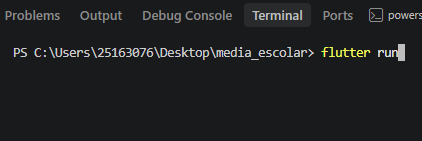

## Atividade - Calculadora de Média Escolar


### Objetivo 

Desenvolver uma aplicação flutter capaz de receber um nome e três notas de um aluno, calcular sua média e apresentar a situação escolar

### Conceitos

- MaterialApp
- Scaffold
- StatefulWidget
- TextField
- TextEditingController
- ElevatedButton
- OutlineButton
- SetState
- Conversão de texto para número
- Condicionais
- Funções 
- Validação de campos 
- SnackBar

## Criar o Projeto Flutter

```bash
Flutter create media_calculadora
 ```

Entre na pasta do projeto

```bash
cd media_escolar
```

Abra o projeto no Visual Studio Code 

```bash
code .
```

Execute o projeto:

```bash
 flutter run
```

Resultado:

### Checklist
- [X] Criar o Projeto Flutter
- [ ] Criar o campo de nome
- [ ] Criar os três campos de nota
- [ ] Criar o botão calcular 
- [ ] Calcular média
- [ ] Verificar situação do aluno
- [ ] Mostrar o resultado
- [ ] Criar o botão limpar
- [ ] Validar notas entre 0 e 10
- [ ] Testar o aplicativo